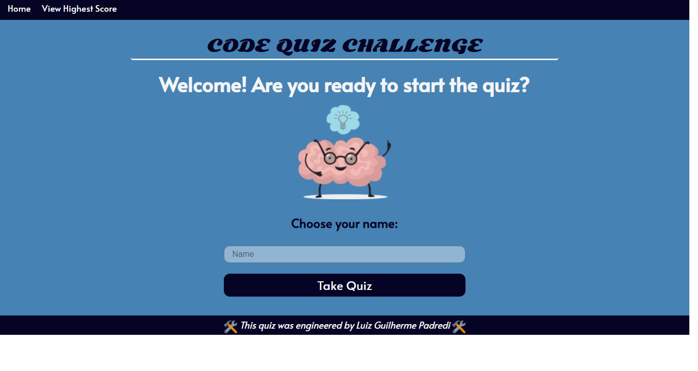

# Luiz Guilherme Padredi

# Code Quiz Web-API

## Description
I created this personalized coding quiz for the fourth challenge of UCF's Coding Bootcamp.

## Instructions
The quiz consists of a few code related questions. 
The user will create a name and take a timed quiz. 
At the end of the quiz, the user will see their final score. 
If the user's score is the new highest score, then the user's name and score will be shown in the Highest Score page.

## Coding Languages Used
* HTML
* CSS
* JavaScript

- jQuery and Bootstrap were not used.

## Website
https://padredilg.github.io/CodeQuizWebAPI/

## Credits
Created by Luiz Guilherme Padredi

<a href='https://www.freepik.com/vectors/education'>Animated brain vectors created by pch.vector - www.freepik.com</a>

